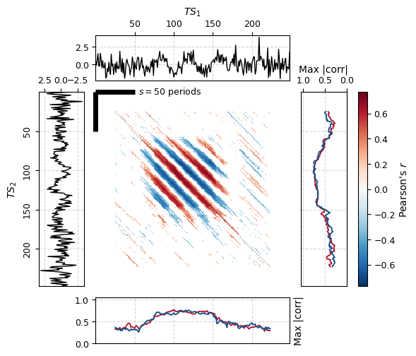

# sdcpy
[](https://pypi.python.com/pypi/sdcpy)


[](https://zenodo.org/badge/latestdoi/329668116)


Scale Dependent Correlation (SDC) analysis<sup>1, 2, 3</sup> in Python.

+ Free software: MIT license
+ Documentation: https://sdcpy.readthedocs.io.

## Installation

Install from [PyPI](https://pypi.org/project/sdcpy/):

```bash
pip install sdcpy
```

Or using [uv](https://docs.astral.sh/uv/):

```bash
uv pip install sdcpy
```

## Usage

The main class is `SDCAnalysis`, which takes two time series as input and performs the SDC analysis. If only one time series is provided, it will be compared with itself.

In this example we generate two synthetic time series with a transient pattern between indices 63-169 to showcase the detection of transient correlations.

```python
import numpy as np
import pandas as pd
from sdcpy import SDCAnalysis

# Synthetic signal with transient pattern between indices 63-169
def tc_signal(i):
    error = np.random.normal()
    if 63 <= i <= 169:
        return np.sin(2 * np.pi * (1 / 37) * i) + 0.6 * error
    return error

np.random.seed(42)
ts1 = pd.Series([tc_signal(i) for i in range(250)])
ts2 = pd.Series([tc_signal(i) for i in range(250)])

# Run SDC analysis
sdc = SDCAnalysis(
    ts1=ts1,             # First time series (pd.Series or np.ndarray)
    ts2=ts2,             # Second time series (pd.Series or np.ndarray)
    fragment_size=50,    # Size of the sliding window fragment
    n_permutations=99,   # Number of permutations for significance testing
    method="pearson",    # Correlation method ("pearson", "spearman" or Callable)
    two_tailed=True,     # Whether to use two-tailed test
    permutations=True,   # Whether to compute p-values via permutation
    min_lag=-np.inf,     # Minimum lag to compute
    max_lag=np.inf,      # Maximum lag to compute
    max_memory_gb=2.0,   # Max memory usage for vectorized ops before chunking
)

# Generate 2-way SDC combi plot
fig = sdc.combi_plot(
    xlabel="$TS_1$",        # Label for top axis (TS1)
    ylabel="$TS_2$",        # Label for left axis (TS2)
    title=None,             # Plot title (None = auto-generated)
    max_r=None,             # Max correlation for color scale (None = auto)
    date_fmt="%Y-%m-%d",    # Date format for axes
    align="center",         # Alignment of heatmap cells ("center", "left", "right")
    min_lag=-np.inf,        # Start of lag range to plot
    max_lag=np.inf,         # End of lag range to plot
    fontsize=9,             # Base font size
    figsize=(7, 7),         # Figure size (width, height)
    show_colorbar=True,     # Whether to show the colorbar
    show_ts2=True,          # Whether to show TS2 time series panel
    dpi=250,                # Resolution for saving/displaying
)

```



### Access Detailed Results

You can access the detailed SDC results DataFrame via `sdc.sdc_df`. This contains the coordinates of each fragment, lag, correlation, and p-value.

```python
sdc.sdc_df.head()
```

```text
   start_1  stop_1  start_2  stop_2  lag       r  p_value 
      0.0    50.0      0.0    50.0  0.0  0.2267   0.0495
      0.0    50.0      1.0    51.0 -1.0 -0.0047   1.0000
      0.0    50.0      2.0    52.0 -2.0  0.0579   0.6238
      0.0    50.0      3.0    53.0 -3.0  0.0602   0.6337
      0.0    50.0      4.0    54.0 -4.0 -0.1660   0.2475
```

### Correlation by Value Range

To check if synchronies occur in specific value ranges of the time series, use `get_ranges_df()`. This computes statistics of Positive/Non-significant/Negative correlations binned by the value of the time series and returns a `pandas.DataFrame` with the results.

```python
sdc.get_ranges_df(
    ts=1,               # Which TS to bin by (1 or 2)
    bin_size=0.5,       # Size of value bins
    agg_func="mean",    # Aggregation function for fragment values
    alpha=0.05,         # Significance threshold
    min_bin=None,       # Manual lower bound for bins (None = auto)
    max_bin=None,       # Manual upper bound for bins (None = auto)
    min_lag=0,          # Minimum lag to include in stats
    max_lag=10,         # Maximum lag to include in stats
)
```

```text
  cat_value direction  counts    n   freq  label
(-0.6, 0.0]  Positive     504 1232 0.4091 40.9 %
(-0.6, 0.0]  Negative       0 1232 0.0000  0.0 %
(-0.6, 0.0]        NS     728 1232 0.5909 59.1 %
 (0.0, 0.5]  Positive     218  883 0.2469 24.7 %
 (0.0, 0.5]  Negative      10  883 0.0111  1.1 %
 (0.0, 0.5]        NS     655  883 0.7418 74.2 %
 (0.5, 1.0]  Positive       1   19 0.0526  5.3 %
 (0.5, 1.0]  Negative       0   19 0.0000  0.0 %
 (0.5, 1.0]        NS      18   19 0.9474 94.7 %
 (1.0, 1.5]  Positive       0    0 0.0000  0.0 %
```

See [examples/basic_usage.py](examples/basic_usage.py) for a complete example with synthetic data showing transient correlations.

## Development

To set up a local development environment:

```bash
# Install uv (if not already installed)
curl -LsSf https://astral.sh/uv/install.sh | sh

# Clone and install
git clone https://github.com/AlFontal/sdcpy.git
cd sdcpy
uv sync --all-groups

# Run tests
uv run pytest
```

See [CONTRIBUTING.md](CONTRIBUTING.md) for more details.

## References

1. Rodó, X. (2001). Reversal of three global atmospheric fields linking changes in SST anomalies in the Pacific, Atlantic and Indian oceans at tropical latitudes and midlatitudes. **Climate Dynamics**, 18:203-217. DOI: 10.1007/s003820100171.

2. Rodríguez, M.A. & Rodó, X. (2004). A primer on the study of transitory dynamics in ecological series using the scale-dependent correlation analysis. **Oecologia**, 138,485-504. DOI: 10.1007/s00442-003-1464-4.

3. Rodó, X. & M.A. Rodriguez-Arias. (2006). A new method to detect transitory signatures and local time/space variability structures in the climate system: the scale-dependent correlation analysis. **Climate Dynamics**, 27:441-458. DOI: 10.1007/s00382-005-0106-4.
